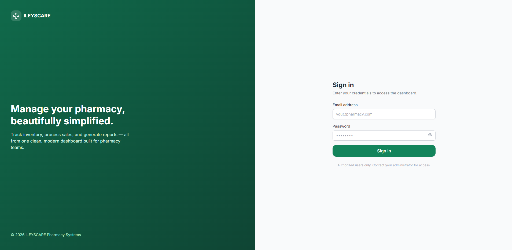

# 💊 MediCare Pharmacy Management System


A modern Pharmacy Management System built with **Next.js 14**, **TypeScript**, **Tailwind CSS**, and **MongoDB**.

---


## 📖 dashbourd overview

<p align="center">
  
</p>


## 🚀 Features

### 📊 Dashboard
- Total Products Overview
- Low Stock Alerts
- Daily, Monthly, and Yearly Sales
- Sales & Profit Charts
- Category Distribution Charts
- Near Expiry Notifications
- Auto Refresh Every 30 Seconds

### 📦 Product Management
- Add New Products
- Edit Product Information
- Delete Products
- Search & Filter Products
- Expiry Date Tracking
- Supplier Information Management
- Low Stock Monitoring

### 🛒 Sales & POS System
- Create Invoices
- Product Selection Cart
- Automatic Stock Reduction
- Automatic Profit Calculation
- Unique Invoice Numbers
- Customer Information Support
- Multiple Payment Methods

### 📈 Reports
- Daily Reports
- Monthly Reports
- Yearly Reports
- Custom Date Range Reports
- PDF Export
- Excel Export

### 🏪 Inventory Management
- Low Stock Monitoring
- Expired Product Tracking
- Near Expiry Alerts
- Inventory Status Overview

### 🔐 Authentication & Authorization
- Secure Login System
- JWT Authentication
- Admin Role
- Employee Role
- Protected Routes
- User Management

### 🎨 User Interface
- Responsive Design
- Dark Mode Support
- Modern Dashboard
- Mobile Friendly
- Printable Invoices

---

## 🛠️ Tech Stack

| Category | Technology |
|-----------|------------|
| Frontend | Next.js 14 |
| Language | TypeScript |
| Styling | Tailwind CSS |
| Database | MongoDB |
| ODM | Mongoose |
| Authentication | NextAuth.js |
| Charts | Recharts |
| PDF Export | jsPDF |
| Excel Export | SheetJS |
| Icons | Lucide React |

---

## 📁 Project Structure

```bash
src/
├── app/
│   ├── dashboard/
│   ├── products/
│   ├── sales/
│   ├── inventory/
│   ├── reports/
│   ├── users/
│   └── login/
│
├── actions/
│   ├── dashboard.actions.ts
│   ├── product.actions.ts
│   ├── sale.actions.ts
│   ├── report.actions.ts
│   └── user.actions.ts
│
├── components/
│   ├── dashboard/
│   ├── products/
│   ├── sales/
│   ├── reports/
│   ├── users/
│   ├── layout/
│   └── ui/
│
├── models/
│   ├── Product.ts
│   ├── Sale.ts
│   ├── User.ts
│   └── Report.ts
│
├── lib/
│   ├── mongodb.ts
│   ├── auth.ts
│   ├── seed.ts
│   ├── exportPdf.ts
│   └── exportExcel.ts
│
└── middleware.ts
```

---

## ⚙️ Installation

### 1. Clone Repository

```bash
git clone <repository-url>
cd pharmacy-management-system
```

### 2. Install Dependencies

```bash
npm install
```

### 3. Create Environment Variables

Create a file named:

```bash
.env.local
```

Add:

```env
MONGODB_URI=mongodb://localhost:27017/pharmacy_management

NEXTAUTH_SECRET=your-secret-key
NEXTAUTH_URL=http://localhost:3000

SEED_ADMIN_EMAIL=admin@pharmacy.com
SEED_ADMIN_PASSWORD=Admin@12345
```

### 4. Seed Database

```bash
npm run seed
```

### 5. Run Application

```bash
npm run dev
```

Open:

```bash
http://localhost:3000
```

---

## 🔑 Default Login

### Admin Account

```text
Email: admin@pharmacy.com
Password: Admin@12345
```

---

## 📖 LOGIN PAGE


<p align="center">
  
</p>
## 👥 User Roles

### Admin
- Full System Access
- User Management
- Product Management
- Reports
- Inventory Control
- Sales Management

### Employee
- Dashboard Access
- Product Access
- Sales Access
- Reports Access
- Inventory Access

---

## 📊 Reports

The system supports:

- Daily Reports
- Monthly Reports
- Yearly Reports
- Custom Reports
- PDF Export
- Excel Export

---

## 🌓 Dark Mode

The application includes built-in Dark Mode support powered by:

- Next Themes
- Tailwind CSS

---

## 🔒 Security Features

- Password Hashing (bcrypt)
- JWT Authentication
- Protected Routes
- Role-Based Authorization
- Secure MongoDB Connection

---

## 📄 License

This project is developed for educational and pharmacy management purposes.

---

## 👨‍💻 Developed With

- Next.js
- TypeScript
- MongoDB
- Tailwind CSS
- NextAuth.js

💙 Built for efficient pharmacy management.